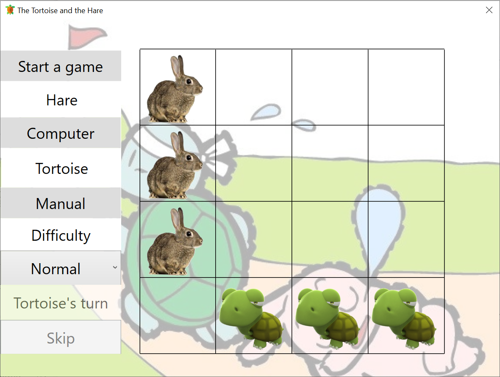

# The-Tortoise-and-the-Hare
A puzzle game about the Tortoise and the Hare! Everyone knows that it comes from Aesop's fable. Now you can play as tortoises or hares and all of animals you played should reach the destination as fast as possible.

## Motivation
It was a project competition in Artificial Intelligence course 2013 from NTNU. Your chess AI is limited to a specific time(< 3 seconds) to response in the competition.

The core algorithm I design for the game is Alpha-Beta Pruning.

## How to Play
1. Tortoises move first, and hares move next, the sequence is reapted until the game is over.
2. You are able to move one tortoise (hare) at a time.
3. The legal moves for hares are up(↑), down(↓) and right(→). While a hare moves to rightmost grids, you can move it to outside and reach to the destination.
4. The legal moves for tortoises are left(←), up(↑) and right(→). While a tortoise moves to topmost grids, you can move it to outside and reach to the destination.
5. You can not jump more than one grid, and click skip button only if you are not able to move your animals.
## Plans and Schedules
- [x] Change Game UI to English (from Traditional Chinese)
- [x] Add more friendly prompts: move prompts
- [x] Add an option to adjust the difficulty 
